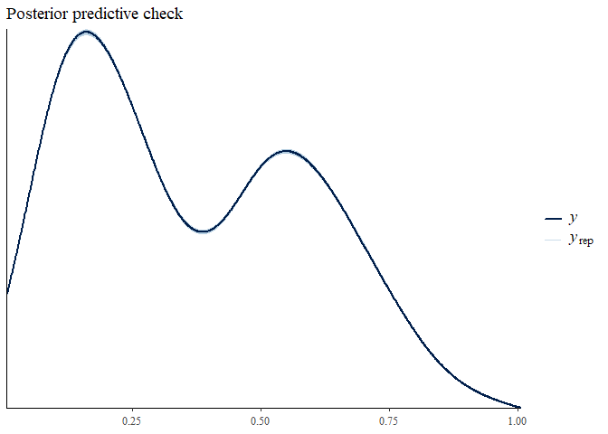
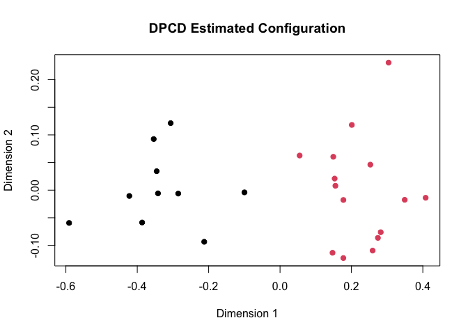

<!-- README.md is generated from README.Rmd. Please edit that file -->

# Dirichlet Process Clustering with Dissimilarities

<!-- badges: start -->

<!-- badges: end -->

The DPCD package implements a Bayesian hierarchical model for clustering
dissimilarity data. The two main objectives of DPCD are to 1. Find a
configuration of the objects such that the distance between them
approximate the input dissimilarities, accounting for measurement error,
and 2. Obtain a meaningful clustering structure for the objects.

## Installation

You can install the DPCD package from CRAN with:

``` r
install.packages('DPCD')
```

## Usage

The main function of the DPCD package is `run_dpcd()`, which fits a
specified DPCD model to dissimilarity data. Here’s a basic example:

``` r
library(DPCD)

# Simulate data and calculate distances
set.seed(123)
x <- rbind(matrix(rnorm(20), ncol = 2), matrix(rnorm(30, mean = 4), ncol = 2))
dis_mat <- dist(x)

# Fit the Equal Spherical DPCD model
fit <- run_dpcd(dis_mat, model = "ES", p = 2, niter = 50000, nburn = 10000)
#> |-------------|-------------|-------------|-------------|
#> |-------------------------------------------------------|
```

The posterior samples can be accessed via the `samples` attribute of the
returned object. You can use the `extract_clusters()` function to obtain
a cluster assignment for each observation:

``` r
clusters <- extract_clusters(fit$samples)
clusters
#>  [1] 1 1 1 1 1 1 1 1 1 1 2 2 2 2 2 2 2 2 2 2 2 2 2 2 2
```

Posterior predictive checks can be performed using the
`post_predictive()` function to ensure that the model fits well. Note
that, by default, the input dissimilarities are scaled so that the
maximum value is 1. This can be toggled off with `scale = TRUE`, but it
is recommended to provide different hyperparameters (using the
`hyper_params` argument) if scaling is disabled.

``` r
ppc <- post_predictive(fit$samples, dis_mat)
```



The latent object configuration can be plotted using the
`plot_objects()` function. Since the latent coordinates of the objects
are non-identifiable, a target matrix must be provided to which the
posterior draws of the object coordinates are aligned.

``` r
target_matrix <- cmdscale(dis_mat, k = 2)
plot_objects(fit$samples, target_matrix = target_matrix, show_clusters = TRUE,
             main = "DPCD Estimated Configuration")
```


